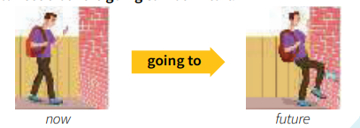
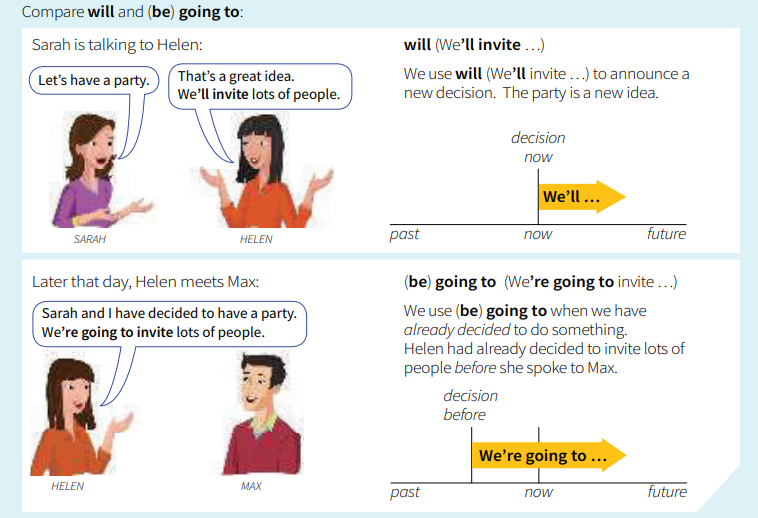

# English Profile

## `for` and `since`

### We use `for + a period of time`
> We’ve been waiting `for two hours`  
> two hours ago -> now  

* two hours
* 20 minutes
* five days
* a long time
* six months
* 50 years
* a week
* ages
* years

### We use `since + the start of a period`

> We’ve been waiting `since 8 o’clock`.  
> 8 o’clock --> now

* 8 o’clock
* Monday
* 12 May
* April
* 2001
* Christmas
* lunchtime
* we arrived
* I got up

## Compare `when …`? (+ past simple) and `how long …` ? (+ present perfect):

A: When `did` it start raining?   
B: It started raining `an hour ago`**(We oft en leave out for (but not usually in negative sentences))** / `at 1 o’clock`.

A: How long `has` it `been` raining?   
B: It’s been raining `for an hour` / `since 1 o’clock`

## `have` and `have got`

> You can use have or have got. There is no difference in meaning   
* They `have` a new car. or They`’ve got` a new car.   
* Lisa `has` two brothers. or Lisa `has got` two brothers.

> In questions and negative sentences there are three possible forms:

* `Do you have` any questions? or `Have you got` any questions? or `Have you` any questions? (less usual)
* `I don’t` have any questions. or `I haven’t got` any questions. or `I haven’t` any questions. (less usual)

### We also use have (but not have got) for things we do or experience. For example:

* have
    * breakfast / dinner / a cup of coffee / something to eat etc.
    * a bath / a shower / a swim / a break / a rest / a party / a holiday
    * an accident / an experience / a dream
    * a look (at something)
    * a chat / a discussion / a conversation (with somebody)
    * trouble / difficulty / fun / a good time etc.
    * a baby (= give birth to a baby

> Have got is not possible in these expressions. Compare:
* Sometimes I have (= eat) a sandwich for my lunch. (not I’ve got)
* but I’ve got / I have some sandwiches. Would you like one?

## `used to (do)`
> Nicola doesn’t travel much these days.   
> She prefers to stay at home.   
> But she `used to travel` a lot.   
> She `used to go away` two or three times a year.   
> She `used to travel` a lot = she travelled often in the past, but she doesn’t do this any more.

| past | now |
|-- |-- |
|used to travel|She doesn't travel|

## `I’m going to (do)`

> I `am going to do` something = I have already decided to do it, I intend to do it:
* a: I hear Sarah won the lottery. What `is` she `going to do` with the money?
* b: She`’s going to buy` a new car.

> You can also say that ‘something is going to happen’ in the future. For example:

The man isn’t looking where he is going.  
He `is going to walk` into the wall.  
When we say that `‘something is going to happen’`,  
the situation now makes this clear.  
The man is walking towards the wall now, so we can see that he `is going to walk` into it.  

* eg: Look at those black clouds! It`’s going to rain`. (we can see the clouds now) 

## `I was going to (do)`

> I was going to do something = I intended to do it, but didn’t do it:

* We were going to travel by train, but then we decided to drive instead. 
* I was just going to cross the road when somebody shouted ‘Stop!’

## I `will` and I`’m going to`

1. ‘Gary has been trying to contact you.’ ‘Has he? OK, I’ll call him.’
2. ‘Gary has been trying to contact you.’ ‘Yes, I know. I’m going to call him.’

## `when I do` and `when I’ve done` `if` and `when`

* I'll call you again later `when I arrive`
1. the main part: I’ll call you again later
2. and when … : `when I arrive`

> We use the present perfect to show that one thing is complete before the other. The two things do not happen together:
eg:
* When I`’ve phoned` Kate, we can go out. (= first I’ll phone Kate and after that we can go out)

> After `if`, we normally use the present (if I do / if I see etc.) for the future:

* I’ll be angry if it happens again. (not if it will happen)
* Don’t worry if I’m late tonight.

### `if` versus `when`

* I might go out later. (it’s possible) If I go out, I’ll get some bread.
* I’m going out later. (for sure) When I go out, I’ll get some bread.

## `if I do …` and `if I did …`

> For Jess, it is possible that they will take the bus, so she says:
* LISA: Shall we take the bus or the train?
* JESS: `If` we `take` the bus, it `will` be cheaper.

> Now Jess knows they are not going to take the bus, so she says:
* JOE: How are you going to travel?
* JESS: We’re going to take the train. If we `took` the bus, it `would` be cheaper, but the train is quicker.

> When we talk about something that will not happen, or we don’t expect that it will happen, we use if + past (if we went / if there was etc.).

* What would you do if you won a lot of money? (I don’t really expect this to happen)
* I’d be surprised if they didn’t come to the party. (I expect them to come)

## `if I knew …` `I wish I knew …`

> Sarah wants to phone Paul, but she can’t do this because she doesn’t know his number. She says:   
> I’d phone him `if I knew` his number.` (I’d phone = I would phone)   
> Sarah doesn’t know Paul’s number, so she says `if I knew`.    
> She imagines what she would do if she knew his number

> We use the past in the same way aft er wish (I wish I knew / I wish you were etc.). We use wish to say that we regret something, that something is not as we would like it to be:

* I wish I knew Paul’s phone number. (= I don’t know it and I regret this)
* Do you ever wish you could fly? (you can’t fly)
* It’s very crowded here. I wish there weren’t so many people. (there are a lot of people)
* I wish I didn’t have to work tomorrow, but unfortunately I do.

## `if I had known …` `I wish I had known …`

> Last month Gary was in hospital for a few days. Rachel didn’t know this. A few days ago they met by chance. Rachel said:   
* If I’d known you were in hospital, I would have gone to visit you. (= I didn’t know, so I didn’t go to visit you)
> If I’d known = If I had known. This tells us that she didn’t know before.

* I’m not hungry. If I was hungry, I would eat something. (now)
* I wasn’t hungry. If I had been hungry, I would have eaten something. (past)

> `I wish I had known`
* I wish I’d known that Gary was ill. I would have gone to see him. (but I didn’t know)
* I feel sick. I wish I hadn’t eaten so much. (I ate too much)
* Do you wish you’d studied science instead of languages? (you didn’t study science)

## `it is said that …` `he is said to …` `he is supposed to …`

> George is very old. Nobody knows exactly how old he is. Both these sentences mean: ‘People say that he is 108 years old.’
* `It is said that` he is 108 years old. or `He is said to` be 108 years old.

> You can use `supposed to …` in the same way as `said to …` :
* I want to see that film. It’s supposed to be good. (= people say it’s good)
* There are many stories about Joe. He’s supposed to have robbed a bank many years ago.

> Sometimes supposed to … has a different meaning. We use supposed to to say what is intended, arranged or expected. Often this is different from the real situation:
* The plan is supposed to be a secret, but everybody seems to know about it. (= the plan is intended to be a secret)
* What are you doing at work? You’re supposed to be on holiday. (= you arranged to be on holiday)
* Our guests were supposed to come at 7.30, but they were late.

> You’re not supposed to do something = it is not allowed or advised:
* You’re not supposed to park your car here. It’s private parking only.
* Joe is much better after his illness, but he’s not supposed to exercise too hard.

## `have` something `done`

> The roof of Lisa’s house was damaged.So she called a builder, and yesterday he came and repaired it.  
> Lisa `had` the roof `repaired` yesterday.  
> This means: Lisa arranged for somebody else to repair the roof. She didn’t repair it herself

* a: Did you make those curtains yourself?
* b: Yes, I like making things.
* a: Did you `have` those curtains `made`?
* b: No, I made them myself.

> We also use have something done with a diff erent meaning. For example:
* Paul and Karen `had` their bags `stolen` while they were travelling.
> This does not mean that they arranged for somebody to steal their bags. ‘They `had` their bags `stolen`’ means only: `‘Their bags were stolen’`.   
> With this meaning, we use have something done to say that something happens to somebody or their belongings:  
* Gary `had` his nose `broken` in a fight. (= his nose was broken)
* Have you ever `had` your bike `stolen`?

## `get` something `done`
> You can say ‘get something done’ instead of ‘have something done’:
* When are you going to `get` the roof `repaired`? (= have the roof repaired)
* I think you should `get` your hair `cut` really short.

